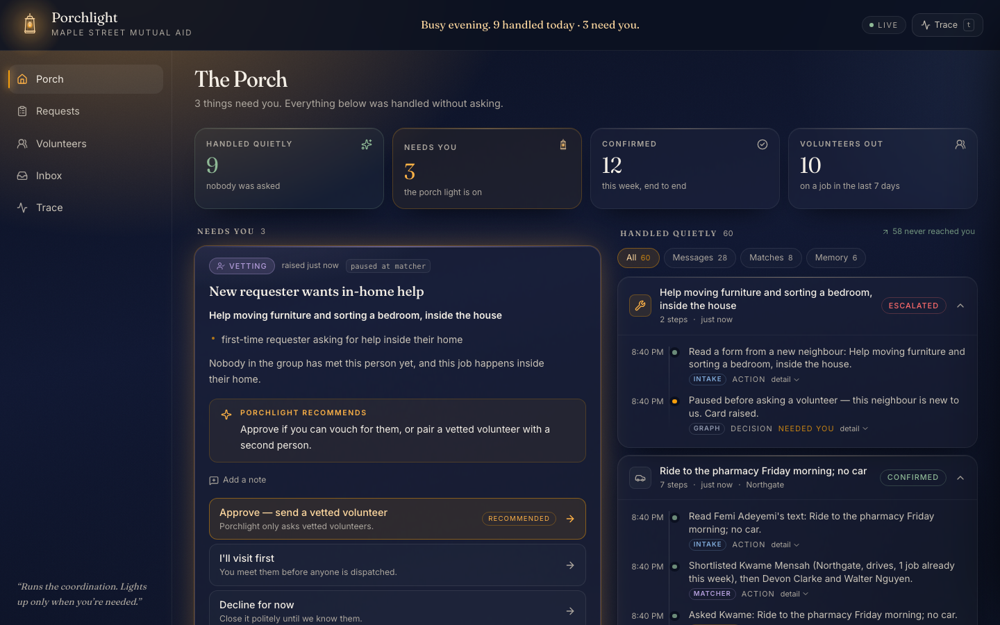
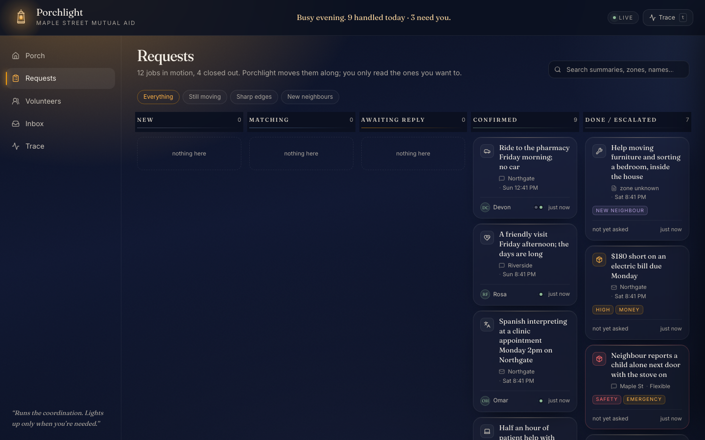
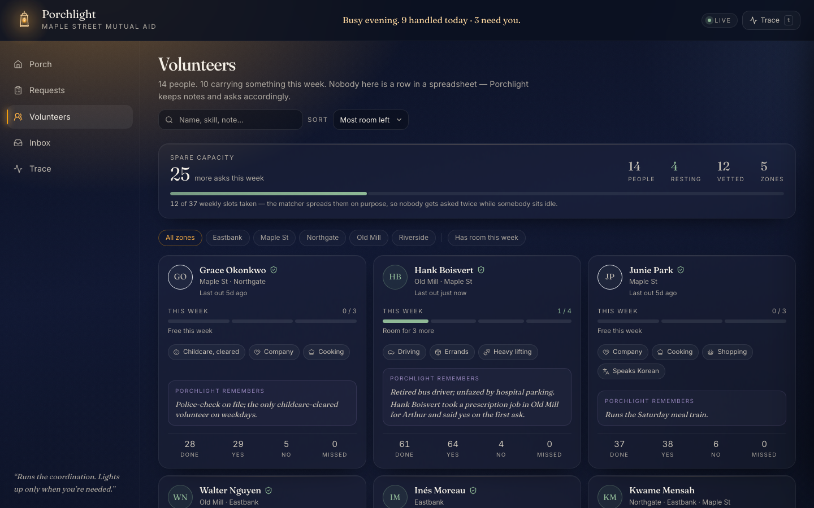
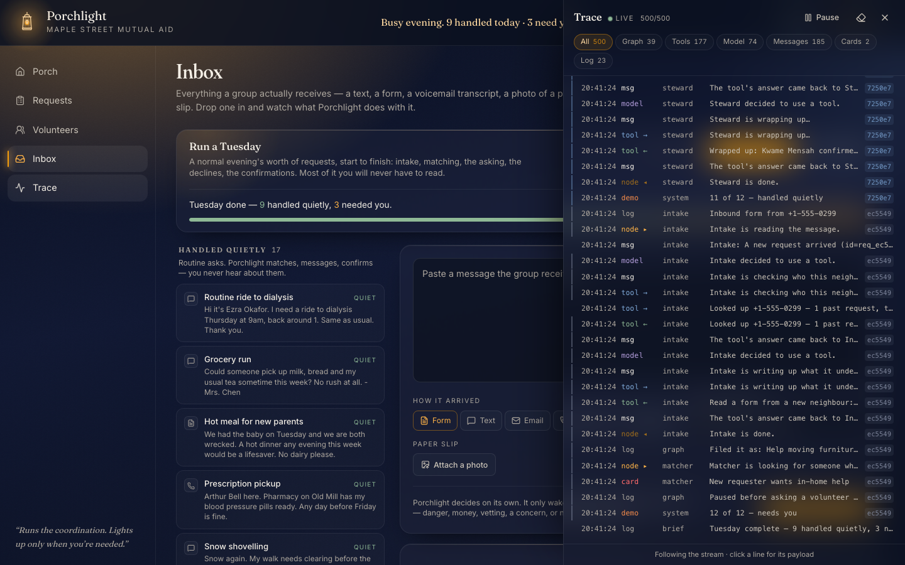
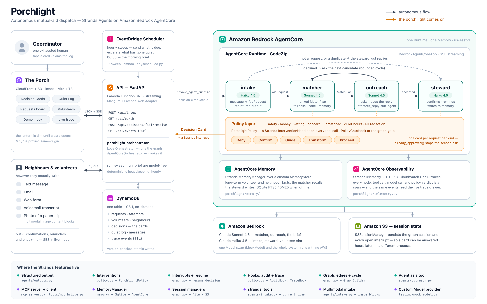

<div align="center">

# Porchlight

### Runs the coordination. Lights up only when you're needed.

An autonomous dispatcher for neighbourhood mutual-aid groups, built with
[Strands Agents](https://strandsagents.com) and deployed on **Amazon Bedrock AgentCore**.
Entry for the AWS *Agents for Humans* hackathon — **Good Neighbor** track.

[](LICENSE)
[](https://strandsagents.com)
[](https://aws.amazon.com/bedrock/agentcore/)
[](#tests)



</div>

---

## The problem

Every mutual-aid group, food pantry, church volunteer team and tenants' association runs on one
exhausted human. Requests arrive as texts, emails, form submissions, voicemail transcripts and
photographs of paper slips. The coordinator reads each one, works out who could help, texts three
people, waits, texts two more, confirms with the neighbour, sends a reminder, handles the no-show,
and then forgets to write any of it down — twenty to sixty times a week.

Almost none of that work needs a person. What *does* need a person is rare and important: a message
that hints at danger, a request for money, a volunteer who reports that something felt off, an
urgent need nobody can cover. Today those get buried in the same pile as *"can someone grab milk for
Mrs. Chen."* The problem is not that the coordinator lacks tools. It is that everything arrives at
the same priority, and only a human sorting the pile can tell the difference.

Coordinator burnout is the single most common reason these groups fold. Porchlight is built for that
one person.

---

## What Porchlight does

It takes every inbound message, turns it into a structured job, ranks the roster, does the outreach
and the follow-up, confirms with the neighbour, and writes what it learned to long-term memory — on
its own. When a real judgement call comes up, the porch light turns on: the coordinator gets a
**Decision Card** with the context, the agent's recommendation, and one-tap options. Everything
else lands in a **Quiet Log** they can skim whenever they like.

```
                                       ┌─ declined → next candidate ─┐
                                       ▼                             │
  message ──▶ intake ──▶ matcher ──▶ outreach ──▶ steward            │
  sms · email    │         Sonnet     Sonnet ─────┘  Haiku           │
  form · photo   │                                                   │
  voicemail      └── not a request, or a duplicate ──▶ steward ◀──────┘

                 ▼  policy layer  ▼
            [ Decision Card ] — a Strands interrupt, persisted; answered hours later
```

The autonomy boundary is not a prompt asking the model to be careful. It is a deterministic policy
engine plus a Strands `InterventionHandler`, enforced twice — once at the graph gate before any
outreach happens, and again at every tool call as defence in depth.

| Situation | What Porchlight does | Where |
|---|---|---|
| Danger language — child alone, chest pain, threats, self-harm, abuse | **Deny** outreach, red card, tell the requester to call emergency services | `DANGER_PATTERNS`, `safety_card` |
| Money: gift cards, bills, cash, anything over the group's petty-cash limit | **Confirm** — a card before any commitment | `MONEY_PATTERNS`, `extract_amount`, `money_card` |
| A first-time requester asking for help *inside* their home | **Confirm** — a vetting card | `IN_HOME_PATTERNS`, `vetting_card` |
| A volunteer reports a concern about a requester or a visit | **Confirm** — a concern card | `CONCERN_PATTERNS`, `concern_card` |
| Nobody accepted after `max_candidates` asks, or the window is closing | Card with options: widen the pool, reschedule, I'll take it, decline | `unmatched_card`, `run_sweep` |
| Matcher confidence below `confidence_threshold` | A card instead of a guess | `PolicyGateHook` |
| A message would go out during quiet hours (21:00–08:00 local) | **Guide** — schedule it for the morning instead | `is_quiet_hours`, `next_send_time` |
| A thank-you note, or a repeat of a request already in hand | Skip matching and outreach; the steward replies once and closes it | `find_similar_open_requests`, `AidRequest.needs_outreach` |
| An outbound message carries the neighbour's phone or address to a volunteer who has not accepted | **Transform** — redact; share only after acceptance | `redact_pii` |
| Everything else — a routine ride, groceries, a meal, with a good match | Fully autonomous, logged with a rationale | — |

Every rule lives in [`porchlight/policy.py`](porchlight/policy.py). A card is asked **once** per
request per kind: the graph gate raises it, the coordinator answers, and `already_approved()` stops
the tool-level policy asking the same question again.

### The six agents

| Agent | Model | Job |
|---|---|---|
| `intake` | Haiku 4.5 | Any inbound channel, including a photo of a paper slip → a structured `AidRequest` |
| `matcher` | Sonnet 4.6 | A ranked, fairness-aware `MatchPlan` with an honest confidence |
| `outreach` | Sonnet 4.6 | Writes personal messages, reads replies through an `interpret_reply` sub-agent, advances to the next candidate |
| `steward` | Haiku 4.5 | Confirms the neighbour, schedules reminders, distils the outcome into memory |
| `brief` | Sonnet 4.6 | The nightly digest the coordinator actually reads |
| `volunteer_sim` | Haiku 4.5 | Demo only: role-plays volunteers so the demo shows real negotiation without real SMS |

---

## See it

▶ **Demo video — 4 min 14 s.** Hosted link: _added at submission._ Until then, build it
yourself with `make video`: it records the real UI against the mock stack and writes
`media/out/porchlight-demo.mp4` plus `media/out/thumbnail.png`. Running order and pipeline in
[`docs/VIDEO.md`](docs/VIDEO.md).

<table>
<tr>
<td width="33%"></td>
<td width="33%"></td>
<td width="33%"></td>
</tr>
<tr>
<td align="center"><b>Requests</b><br>new → matching → awaiting reply → confirmed</td>
<td align="center"><b>Volunteers</b><br>load spread, skills, memory notes</td>
<td align="center"><b>Trace</b><br>every node, tool call and policy verdict, live</td>
</tr>
</table>

More in [`docs/screenshots/`](docs/screenshots): the porch after a card is resolved, the all-quiet
empty state, a request drawer, the demo inbox mid "Run a Tuesday", and the mobile layout.

---

## How it's built with Strands Agents

Judges score depth, so here is exactly where each feature lives.

| Strands feature | Where |
|---|---|
| `Agent` with a Pydantic `structured_output_model` on every agent | [`porchlight/agents/base.py`](porchlight/agents/base.py), [`agents/outputs.py`](porchlight/agents/outputs.py) |
| `@tool(context=True)` — 15 tools reading `AppContext` off `invocation_state` | [`porchlight/tools/`](porchlight/tools) |
| Agent-as-a-tool — `interpret_reply` is a one-shot agent exposed as a tool | [`agents/outreach.py`](porchlight/agents/outreach.py) |
| `GraphBuilder`: conditional edges, a bounded outreach cycle, `set_max_node_executions`, `reset_on_revisit` | [`porchlight/graph.py`](porchlight/graph.py) |
| **Interventions** — `InterventionHandler` returning `Deny` / `Confirm` / `Guide` / `Transform` / `Proceed` | `PorchlightPolicy` in [`policy.py`](porchlight/policy.py) |
| **Interrupts as Decision Cards** — raised with `event.interrupt(...)`, persisted, resumed with `interruptResponse` | `PolicyGateHook`, `resume_decision` in [`graph.py`](porchlight/graph.py) |
| **Hooks** — `BeforeToolCallEvent` / `AfterToolCallEvent` → the Quiet Log; `MessageAddedEvent` / `AfterModelCallEvent` / `BeforeNodeCallEvent` → the live trace | `AuditHook`, `TraceHook` in [`policy.py`](porchlight/policy.py) |
| `SlidingWindowConversationManager` | [`agents/base.py`](porchlight/agents/base.py) |
| Session managers — `FileSessionManager` locally, `S3SessionManager` on AWS | `make_session_manager` in [`graph.py`](porchlight/graph.py) |
| `MemoryManager` over a custom `MemoryStore` — SQLite FTS5/BM25 locally, AgentCore Memory on AWS | [`porchlight/memory/`](porchlight/memory) |
| **MCP** — the same data tools served over stdio and consumed with `MCPClient` when `PORCHLIGHT_TOOLS=mcp` | [`mcp_server.py`](porchlight/mcp_server.py), [`tools/mcp_bridge.py`](porchlight/tools/mcp_bridge.py) |
| `strands_tools` — `current_time` on intake | [`agents/intake.py`](porchlight/agents/intake.py) |
| Multimodal intake — image content blocks for photographed paper slips | `build_intake_task` in [`agents/intake.py`](porchlight/agents/intake.py) |
| `StrandsTelemetry` OTLP → AgentCore Observability | [`porchlight/telemetry.py`](porchlight/telemetry.py) |
| AgentCore Runtime — `BedrockAgentCoreApp` entrypoint with SSE streaming | [`porchlight/runtime.py`](porchlight/runtime.py) |
| A custom `strands.models.Model` — so the whole system runs with no AWS account | [`testing/mock_model.py`](porchlight/testing/mock_model.py), [`sim/mock_scenarios.py`](porchlight/sim/mock_scenarios.py) |

**The intervention** — one branch of the autonomy boundary, from
[`policy.py`](porchlight/policy.py). `spec.confirm()` returns a Strands `Confirm`, which becomes an
interrupt, which becomes a Decision Card:

```python
money = [flag for flag in has_kind(flags, DecisionKind.MONEY) if flag.needs_card()]
if (
    money
    and (to_volunteer or tool_name in MESSAGE_TOOLS or tool_name == "close_request")
    and not already_approved(ctx.store, request_id, DecisionKind.MONEY)
):
    spec = money_card(request, money, ctx.settings)
    self._note(ctx, spec, tool_name)
    return spec.confirm()
```

**The graph** — four agents, a short-circuit edge for messages that are not requests, and a bounded
retry cycle back to the matcher after a decline, from [`graph.py`](porchlight/graph.py):

```python
builder = GraphBuilder()
builder.add_node(make_intake_agent(ctx), "intake")
builder.add_node(make_matcher_agent(ctx), "matcher")
builder.add_node(make_outreach_agent(ctx), "outreach")
builder.add_node(make_steward_agent(ctx), "steward")

builder.add_edge("intake", "matcher", condition=should_match)
builder.add_edge("intake", "steward", condition=should_close_out)      # not a request / duplicate
builder.add_edge("matcher", "outreach", condition=should_outreach)
builder.add_edge("outreach", "matcher", condition=should_retry)        # declined → next candidate
builder.add_edge("outreach", "steward", condition=should_steward)
builder.set_entry_point("intake")

builder.set_max_node_executions(2 + 2 * (max(1, settings.max_candidates) + 1) + 3)
builder.reset_on_revisit(True)
builder.set_hook_providers([PolicyGateHook(ctx), RequestSyncHook(ctx), TraceHook(ctx)])
```

**The resume** — the coordinator's tap, hours later and in a different process. The session id is
the request id, so rebuilding the graph restores exactly the state the interrupt paused at:

```python
graph = build_graph(ctx, session_id=request_id)
responses = [
    {
        "interruptResponse": {
            "interruptId": decision.interrupt_id,
            "response": {"option": option_id, "note": note},
        }
    }
]
result = graph(responses, invocation_state={"ctx": ctx, "request_id": request_id})
```

---

## Architecture



Deep dive: **[docs/ARCHITECTURE.md](docs/ARCHITECTURE.md)** — request lifecycle, data model, the
policy engine, interrupt/resume mechanics, memory design, deployment topology, cost, limitations.
Design spec: [docs/DESIGN.md](docs/DESIGN.md). Module contracts: [docs/CONTRACTS.md](docs/CONTRACTS.md).

### On AgentCore

| Service | What it holds |
|---|---|
| **AgentCore Runtime** | The whole Strands graph, packaged as a CodeZip from [`runtime/`](runtime) with a `BedrockAgentCoreApp` entrypoint that streams trace events back as SSE |
| **AgentCore Memory** | Long-term facts about volunteers and neighbours, behind a Strands `MemoryStore` so the local SQLite store is a drop-in replacement |
| **AgentCore Observability** | `StrandsTelemetry` OTLP spans for every node, tool call, model call and policy verdict, landing in CloudWatch |

The AgentCore project is [`agentcore/`](agentcore) (one Runtime, one Memory, deployed by the
AgentCore CLI).

### The rest of the AWS stack

Everything else is one CDK app, [`infra/`](infra):

| Service | Role |
|---|---|
| **Amazon Bedrock** | Claude Sonnet 4.6 for judgement (matcher, outreach, brief), Claude Haiku 4.5 for the fast tier (intake, steward, sim) |
| **AWS Lambda** | FastAPI behind a streaming Function URL (Lambda Web Adapter, so `/api/events` really streams), plus a sweep/brief function |
| **Amazon DynamoDB** | One table + GSI1: requests, volunteers, neighbours, decisions, the quiet log, outbound messages, and the trace (with a TTL) |
| **Amazon S3** | The session bucket Strands' `S3SessionManager` persists graph sessions and open interrupts to, and the static bundle for the UI |
| **Amazon CloudFront** | The Porch, with `/api/*` proxied to the Function URL so the app is same-origin |
| **Amazon EventBridge Scheduler** | The hourly sweep and the 06:00 brief |
| **Amazon SES** | Outbound email in live mode (`EmailChannel`); a `SimChannel` stands in for the demo |

The two halves never import each other. They meet through four names — the runtime ARN, the memory
id, the table and the session bucket — handed over through SSM and `.env.deploy`;
`tests/v_test_deploy_config.py` reads both halves as data and fails the build if they ever stop
agreeing. Deploying only the app stack works too: with no runtime ARN the API runs the graph
in-process and calls Bedrock directly, which is a complete, demoable system.

---

## Run it locally

No AWS account and no credentials are needed for any of this.

```bash
git clone <this repo> && cd porchlight
python3.12 -m venv .venv && source .venv/bin/activate
make install          # uv pip install -e ".[dev]"

make test             # 626 tests, no network
make demo-mock        # six neighbourhood requests through the real Strands graph
```

`make demo-mock` narrates the whole day — every node, tool call, message and policy decision — then
prints what was handled quietly and what needs the coordinator:

```
== SUMMARY ==========================================================================
  request           sample                      status          outcome
  ------------------------------------------------------------------------------
  req_4d6d3a4dfa    Routine ride to dialysis    confirmed       handled quietly
  req_87ca17a808    Grocery run                 confirmed       handled quietly
  req_ccebd37b0a    Hot meal for new parents    confirmed       handled quietly
  req_06526f7d39    Child home alone, stove on  escalated       needs you — Possible emergency
  req_c97b074f28    Prescription pickup         confirmed       handled quietly
  req_f3b1f6b389    Snow shovelling             confirmed       handled quietly

  5 handled quietly · 1 needed the coordinator · 601 trace events
```

Then open **The Porch**, in two terminals:

```bash
PORCHLIGHT_MODEL_PROVIDER=mock make api          # FastAPI on http://localhost:8000
cd web && npm install && npm run dev             # the UI on http://localhost:5173
```

Vite proxies `/api` to port 8000. Use **Reset demo** in the Inbox screen (or
`curl -X POST localhost:8000/api/demo/reset`) to load the Maple Street fixtures — 14 volunteers,
8 neighbours, 24 sample messages — then paste a message, pick a sample, or hit **Run a Tuesday**.

Other entry points:

```bash
python scripts/run_day.py --reset                  # all 24 sample messages
python scripts/run_day.py --sample-id sm_gift_card # one specific message
python scripts/seed.py                             # load the fixtures into the local store
make lint                                          # ruff check .
```

With Bedrock credentials configured, drop `PORCHLIGHT_MODEL_PROVIDER=mock` and the same commands run
against Claude Sonnet 4.6 and Haiku 4.5.

### Configuration

Every variable is optional; copy [`.env.example`](.env.example) to `.env` to change any of them. The
ones that matter most:

| Variable | Default | What it does |
|---|---|---|
| `PORCHLIGHT_MODEL_PROVIDER` | `bedrock` | `mock` runs the whole system with no AWS |
| `PORCHLIGHT_MODE` | `demo` | `demo` = SQLite + simulated channel; `live` = configured store + email |
| `PORCHLIGHT_STORE` | `sqlite` | `sqlite` or `dynamo` (single table) |
| `PORCHLIGHT_TOOLS` | `local` | `mcp` consumes the same tools over MCP instead |
| `PORCHLIGHT_SESSION_BUCKET` | — | Set to use `S3SessionManager` instead of files |
| `PORCHLIGHT_MEMORY_ID` | — | AgentCore Memory id; unset uses the SQLite memory store |
| `PORCHLIGHT_AGENT_RUNTIME_ARN` | — | When set, the API calls AgentCore Runtime instead of running in-process |
| `PORCHLIGHT_QUIET_HOURS` | `[21, 8]` | Nothing goes out between these local hours |
| `PORCHLIGHT_PETTY_CASH_LIMIT` | `40.0` | Above this, money needs a Decision Card |
| `PORCHLIGHT_MAX_CANDIDATES` | `3` | Volunteers asked before escalating |
| `PORCHLIGHT_CONFIDENCE_THRESHOLD` | `0.55` | Below this the matcher raises a card instead of guessing |

The full table — models, region, timezone, group name, escalation window, SES sender, paths — is in
[`.env.example`](.env.example) and [docs/CONTRACTS.md §2](docs/CONTRACTS.md).

---

## Deploy to AWS

**[docs/DEPLOY.md](docs/DEPLOY.md)** is the full guide: prerequisites, `aws login`, Bedrock model
access, `cdk bootstrap`, verifying, a troubleshooting table, and tearing down.

```bash
make smoke-bedrock    # prove this account can actually call the models
make deploy           # AgentCore Runtime + Memory, then the app stack (10–15 min the first time)
make destroy          # tear both halves down
```

Both builds also work with **no AWS credentials at all**, which is the cheap way to check them:

```bash
make synth            # render the app stack's CloudFormation
make package-runtime  # build the AgentCore CodeZip
```

Everything is on-demand and idles at approximately nothing; the only real spend is Bedrock tokens —
a few cents for a 24-request demo day. Full breakdown in
[docs/DEPLOY.md §6](docs/DEPLOY.md) and [docs/ARCHITECTURE.md](docs/ARCHITECTURE.md).

---

## Tests

```bash
make test                                # everything
pytest -q tests/i_test_integration.py    # the end-to-end graph tests
```

**626 tests, all offline.** They cover the domain model and store, the six-component matcher, all 15
tools (called directly *and* through a real `strands.Agent`), the channels, the memory stores, a
real MCP round trip over stdio, every policy rule, the plain-English summariser behind every Quiet
Log row, the agents, the graph's four scenarios (routine / safety / decline-decline-accept /
resume-in-a-new-process), the runtime, the API, and an end-to-end pass of every one of the 24 sample
messages through the real Strands graph.

The `h_*` modules cover the hardening: fifty rounds of concurrent `assign_volunteer` /
`record_attempt` against one row, the not-a-request and duplicate short circuits, and the persisted
trace behind `/api/events/poll`. `v_test_deploy_config.py` reads `agentcore/` and `infra/` as data
and fails if the two deployment halves stop agreeing about the table, the bucket, the region, or an
env var name — the kind of drift that is otherwise silent until a live invocation.

The offline demo is driven by `PorchlightScenarioModel`, a `strands.models.Model` that plays each
agent's part from live state rather than replaying a canned script — it ranks the real roster, texts
real volunteers through `SimChannel`, and reads their replies — so a mock run exercises the same
tools, hooks and interventions as a Bedrock run.

---

## Repo layout

```
porchlight/
  agents/          intake, matcher, outreach (+ interpret_reply), steward, brief, prompts, outputs
  channels/        Channel protocol; SimChannel (demo) and EmailChannel (SES)
  memory/          SqliteMemoryStore (FTS5 + BM25) and AgentCoreMemoryStore
  sim/             fixtures (14 volunteers, 8 neighbours, 24 sample messages), the volunteer
                   simulator, and mock_scenarios.py (the offline demo's model)
  store/           Store protocol; SqliteStore and DynamoStore
  testing/         MockModel / ScenarioModel and the Pydantic example synthesizer
  tools/           the 15 @tool functions grouped per agent, summaries.py, the MCP bridge
  graph.py         the Strands Graph: run_request / resume_decision / run_sweep / run_brief
  policy.py        deterministic rules, decision cards, PorchlightPolicy, AuditHook, TraceHook
  matching.py      the six-component volunteer scoring model
  orchestrator.py  LocalOrchestrator (in-process) and AgentCoreOrchestrator (invoke_agent_runtime)
  runtime.py       the AgentCore Runtime entrypoint
  mcp_server.py    the read-only tools, served over MCP
api/               FastAPI app; scheduled.py for the sweep/brief Lambda
web/               "The Porch" — React + Vite + Tailwind
agentcore/         the AgentCore project: one Runtime, one Memory, and the CLI's CDK app
runtime/           the CodeZip codeLocation — main.py, its IAM policy, its dependency manifest
infra/             CDK app for everything else: table, buckets, Lambdas, scheduler, CloudFront
scripts/           seed.py, run_day.py, build_lambda.sh, smoke_bedrock.py
docs/              ARCHITECTURE.md, DESIGN.md, CONTRACTS.md, DEPLOY.md, UI.md, VIDEO.md,
                   architecture.svg (hand-authored) + diagram/, screenshots/, submission/
tests/             pytest; foundation_*, a_*, b_*, c_*, h_*, i_*, v_* by area
```

The diagram above is hand-authored SVG — [`docs/architecture.svg`](docs/architecture.svg) — and
rasterised to PNG at 2x with [`docs/diagram/render.mjs`](docs/diagram/render.mjs)
(`node docs/diagram/render.mjs`).

---

## Hackathon submission

**AWS Agents for Humans** — *Good Neighbor Agents* track.

- Devpost write-up: [`docs/submission/devpost-about.md`](docs/submission/devpost-about.md)
- builder.aws.com post: [`docs/submission/builder-aws-post.md`](docs/submission/builder-aws-post.md)
- Demo video shot list: [`docs/VIDEO.md`](docs/VIDEO.md)
- Design spec: [`docs/DESIGN.md`](docs/DESIGN.md) · Architecture: [`docs/ARCHITECTURE.md`](docs/ARCHITECTURE.md)

---

## License

MIT — see [LICENSE](LICENSE).
