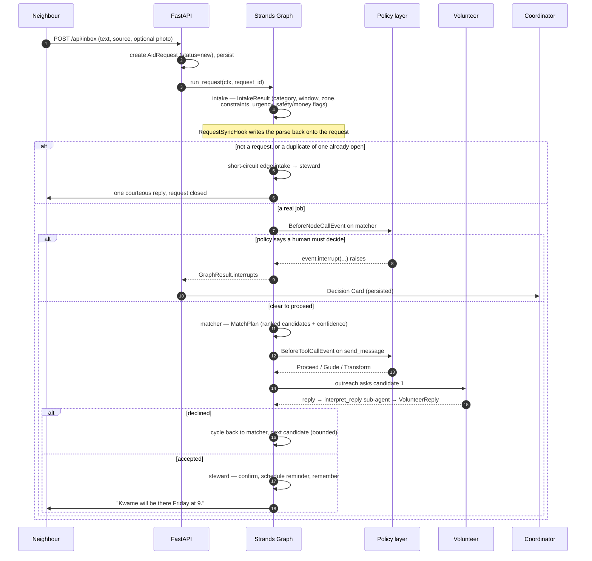

# Porchlight — Architecture

How the system is put together, and why. Start with the [README](../README.md) for what it does;
[DESIGN.md](DESIGN.md) is the original spec, [CONTRACTS.md](CONTRACTS.md) is the module-by-module
interface list, and [DEPLOY.md](DEPLOY.md) is the operational guide.


---

## 1. The shape of it

Porchlight is three things that stay deliberately separate:

1. **The agent system** — five Strands `Agent`s, four of them wired into a `Graph`, plus a
   deterministic policy layer. It knows nothing about HTTP. Everything it touches goes through a
   `Store`, a `Channel`, a `MemoryStore` and a `Clock`, handed to it in a single `AppContext`.
2. **The API** — FastAPI, which owns HTTP, the SSE trace stream, and the demo endpoints. It calls
   the agent system through an `Orchestrator` interface with two implementations: in-process
   (`LocalOrchestrator`) or over `bedrock-agentcore.invoke_agent_runtime` (`AgentCoreOrchestrator`).
3. **The Porch** — a React SPA that only speaks to the API.

Every adapter is chosen by environment variable at context-construction time, so the same code runs
as a local SQLite demo with a mock model or as a DynamoDB-backed deployment calling Claude on
Bedrock. `porchlight/context.py: build_context()` is the only place that decides.

```
AppContext(settings, store, channel, memory, clock, emit)
   store    →  SqliteStore | DynamoStore
   channel  →  SimChannel  | EmailChannel (SES)
   memory   →  SqliteMemoryStore (FTS5/BM25) | AgentCoreMemoryStore
   clock    →  Clock | FrozenClock (tests)
   emit     →  push one trace event to whoever is listening (SSE, stdout, the store)
```

Tools receive it as `tool_context.invocation_state["ctx"]` — every tool is declared
`@tool(context=True)` — and the graph is invoked with
`invocation_state={"ctx": ctx, "request_id": request_id}`. There are no globals and no import-time
AWS clients; boto3 is constructed lazily inside the functions that need it, which is what lets the
whole test suite run with no credentials.

---

## 2. Request lifecycle



**Node by node:**

| Node | Structured output | What it changes |
|---|---|---|
| `intake` | `IntakeResult` | Fills in category, summary, window, zone, constraints, urgency, `safety_flags`, `money_involved`, `first_time_requester`, `is_request`, `duplicate_of`. Status `new` → `matching`. |
| `matcher` | `MatchPlan` | Ranked candidates with per-candidate rationale and an overall `confidence`. Nothing is sent yet. |
| `outreach` | `OutreachStep` | One candidate per pass: `send_message`, `read_replies`, `interpret_reply`, then `record_attempt` and either `assign_volunteer` (→ `confirmed`) or a decline (→ back to the matcher). |
| `steward` | `StewardResult` | Confirms the neighbour, `schedule_message` for the reminder and the day-after check-in, `remember()` what was learned, `close_request` when it is done. |

**Edges** ([`graph.py`](../porchlight/graph.py)) are all conditional and all read the *stored*
request rather than graph state, so a coordinator's decision taken between passes is visible
immediately:

- `intake → matcher` when `request.needs_outreach()`
- `intake → steward` when it does not (a thank-you note, an update, a duplicate)
- `matcher → outreach` unless the request is in a halted status
- `outreach → matcher` on a decline or a counter-offer, while `len(attempts) <= max_candidates`
- `outreach → steward` once someone has accepted

The cycle is bounded twice over: by that attempt count, and by
`set_max_node_executions(2 + 2 * (max_candidates + 1) + 3)`. The extra pair is deliberate — it lets
the graph re-enter `outreach` one hop past the last candidate so the "nobody free" card is raised as
a resumable interrupt instead of the run ending quietly with an unanswered request.
`reset_on_revisit(True)` means each revisited node starts from a clean message list rather than
re-reading a growing transcript.

### Off the critical path

- **The sweep** (`run_sweep`, hourly via EventBridge Scheduler) is deliberately **model-free** — a
  cron job, not an agent. It sends scheduled messages that have come due, and escalates any request
  in `matching` or `awaiting_reply` that is either within `escalate_hours_before_window` of its
  window or has exhausted `max_candidates` without an acceptance. Escalation writes an `unmatched`
  Decision Card directly (node `"sweep"`, no interrupt to resume — the options act on the request).
- **The brief** (`run_brief`, 06:00) is one Sonnet call over `query_requests` / `query_log`.

---

## 3. Data model and storage

Pydantic v2 models in [`porchlight/models.py`](../porchlight/models.py), `extra="forbid"`
everywhere, timezone-aware UTC datetimes throughout, ids prefixed and 10 hex chars
(`req_`, `vol_`, `rqr_`, `dec_`, `msg_`, `log_`).

| Entity | Notes |
|---|---|
| `Volunteer` | zones, skills, weekday availability windows, `max_per_week`, `vetted`, `notes` (memory), `stats` (accepted / declined / completed / no_show / last_active) |
| `Requester` | contact, zone, address, `first_seen`, `history_count`, notes |
| `AidRequest` | the job: category, window, constraints, urgency, `safety_flags`, `money_involved`, `first_time_requester`, `status`, `assigned_volunteer_id`, `attempts[]`, `version`, `is_request`, `duplicate_of` |
| `Decision` | a card: kind, title, context, recommendation, `options[]`, `interrupt_id`, `session_id`, `node`, status |
| `LogEvent` | the Quiet Log: agent, kind, plain-English `summary`, `detail`, `autonomous`, `visible` |
| `OutboundMessage` | recipient, channel, body, `scheduled_for`, `sent_at`, status |

Two fields carry more weight than their size suggests:

- **`AidRequest.version`** — optimistic concurrency, store-managed. `update_request_fields` takes an
  `expected_version` and bumps it; a lost race raises `StaleVersionError`. `append_attempt` and
  `resolve_attempt` are separate, narrower operations that touch only the attempts list, so two
  agents settling different candidates cannot clobber each other's writes.
  `tests/h_test_store_concurrency.py` runs fifty concurrent rounds against one row.
- **`LogEvent.visible`** — `False` marks bookkeeping (lookups, reads, the audit copy of a row a tool
  already wrote). `GET /api/porch` filters to visible rows so the coordinator's log reads like a
  diary rather than a syscall trace; `?all=1` returns everything. The wording for every row comes
  from one place, [`porchlight/tools/summaries.py`](../porchlight/tools/summaries.py), so an MCP
  round trip and an in-process call produce identical prose.

### Two stores, one protocol

`SqliteStore` (WAL, JSON columns, one lock, `:memory:` allowed) and `DynamoStore` implement the same
`Store` protocol. The Dynamo layout is single-table:

```
pk     = "<ENTITY>#<id>"                 e.g. "REQUEST#req_9f3a1c04bd"
sk     = "<ENTITY>"
gsi1pk = "<ENTITY>"                      the partition for "all requests"
gsi1sk = "<status>#<created_at>#<id>"    sorts by status, then time
```

Atomic field writes are `UPDATE ... WHERE id = ? AND version = ?` in SQLite and
`UpdateExpression` + `ConditionExpression version = :expected` in Dynamo; `append_attempt` is a
`list_append`. Persisted trace items carry an `expires_at` epoch second so DynamoDB's TTL sweeps
them.

### The matcher

Not a model call — [`porchlight/matching.py`](../porchlight/matching.py) is deterministic scoring
that the `matcher` agent reads through the `find_candidates` tool. Six weighted components summing
to 1.0:

| Component | Weight | What it measures |
|---|---|---|
| skills | 0.26 | required skills for the category, plus constraint keywords ("walker", "stairs") |
| availability | 0.20 | hours of the request window covered by the volunteer's weekday windows |
| zone | 0.18 | zone adjacency distance |
| fairness | 0.16 | `1 − load_this_week / max_per_week`; at or over cap multiplies the score by 0.45 |
| reliability | 0.10 | follow-through, recency (14 days = fully warm), no-show rate |
| memory | 0.10 | long-term notes that overlap this request, weighted up if the note names them |

Every candidate carries plain-English `reasons`, which is what makes both the Quiet Log and a
Decision Card explainable without a second model call.

---

## 4. The policy engine

The autonomy boundary is deterministic code, enforced at two independent points.

**Point one — the graph gate.** `PolicyGateHook` (a Strands `HookProvider`) subscribes to
`BeforeNodeCallEvent` on `matcher` and `outreach`. Before the matcher runs it evaluates
`evaluate_request(request, settings)` — pure pattern matching over the request text and fields —
and asks `card_for(...)` whether a card is due. Before outreach it checks the `MatchPlan`: no
candidates, or `confidence < confidence_threshold`, or `len(attempts) >= max_candidates` raises the
unmatched card. **Nothing has been sent at this point**, which is the whole reason the gate exists
in front of the tools rather than only inside them.

**Point two — the tool boundary.** `PorchlightPolicy` is a Strands `InterventionHandler`. Its
`before_tool_call` runs on every gated tool (`send_message`, `schedule_message`, `assign_volunteer`,
`close_request`, `remember`, `record_attempt`) and returns one of five verdicts, in this order:

| Verdict | When |
|---|---|
| `Deny` | The request is halted (coordinator took it over, or it is closed) and the call would contact a volunteer; or danger language is present and the call would dispatch anyone. The reason text tells the agent to reply to the requester about emergency services and stop. |
| `Confirm` | Money over the petty-cash limit, a first-time requester wanting in-home help, or a volunteer reporting a concern — and no card of that kind has already been approved. |
| `Guide` | Quiet hours. The feedback names the exact replacement call: `schedule_message` with `send_at_iso` set to the next send time. |
| `Transform` | An outbound message carries the neighbour's phone or address to a volunteer who has not accepted, or is not vetted. `redact_pii` rewrites the body in place. |
| `Proceed` | Everything else. |

Two rules keep this from becoming annoying:

- **`already_approved(store, request_id, kind)`** — once the coordinator has answered a card of a
  given kind for a given request, the tool-level policy stops asking. A card is raised **once per
  request per kind**.
- **`PolicyGateHook._answered`** — the same guard within a single graph run, keyed by
  `(node_id, kind)`, so re-entering `outreach` in the retry cycle does not re-raise a card the
  coordinator has already dealt with on this pass.

Rules and card copy live together in [`policy.py`](../porchlight/policy.py):
`DANGER_PATTERNS` / `MONEY_PATTERNS` / `IN_HOME_PATTERNS` / `CONCERN_PATTERNS`, `extract_amount`,
`is_quiet_hours` / `next_send_time`, `contains_pii` / `redact_pii`, and the `*_card` builders that
produce a `DecisionSpec` (title, context, recommendation, options).

---

## 5. Interrupts and resume — the exact mechanics

This is the part that makes a Decision Card more than a to-do item.

**Raising.** Inside `PolicyGateHook._before_node`:

```python
# Raises InterruptException the first time; returns the coordinator's answer on resume.
response = event.interrupt(INTERRUPT_NAME, reason=spec.prompt())
self._answered.add((event.node_id, str(spec.kind)))
self._apply(request, spec.kind, response)
```

`spec.prompt()` encodes the whole card — kind, title, markdown context, recommendation, option list
— as the interrupt's `reason`, so nothing about the card has to be reconstructed later. At the tool
boundary the equivalent is `spec.confirm()`, which returns a Strands `Confirm`; Strands turns that
into the same kind of interrupt.

**Persisting.** The graph is built with a session manager keyed on the request id:

```python
graph = build_graph(ctx, session_id=request_id)   # FileSessionManager, or S3SessionManager
```

`make_session_manager` returns `S3SessionManager(session_id, bucket=settings.session_bucket)` when
`PORCHLIGHT_SESSION_BUCKET` is set and `FileSessionManager(session_id, storage_dir=session_dir)`
otherwise. Strands writes the paused graph state — including the open interrupt — through it.

**Surfacing.** `run_request` finishes with a `GraphResult` that carries `.interrupts`. `_decisions_for`
turns each into a `Decision` row: it decodes the payload out of `interrupt.reason`, records
`interrupt_id`, `session_id` and the node that raised it, and writes it to the store.

Working out *which* node raised an interrupt takes one piece of local knowledge: Strands derives the
node's interrupt id from a `uuid5(NAMESPACE_OID, node_id)` fragment, so `_node_ids_by_uuid()` maps
it back. Because that id is derived from the node name, the same node raises the *same* interrupt id
in two different runs — the `(session_id, interrupt_id)` pair is what makes a card unique, and
de-duplicating on it is what stops a re-run producing a second identical card.

**Resuming.** Hours later, in a different process, possibly on a different machine:

```python
graph = build_graph(ctx, session_id=request_id)   # rebuilt; the session manager restores the state
responses = [
    {
        "interruptResponse": {
            "interruptId": decision.interrupt_id,
            "response": {"option": option_id, "note": note},
        }
    }
]
result = graph(responses, invocation_state={"ctx": ctx, "request_id": request_id})
```

The paused node re-runs, `event.interrupt(...)` returns the coordinator's answer instead of raising,
and `_apply` turns the chosen option into a state change: an approving option puts the request back
into `matching`, `decline_request` closes it, anything else (`i_will_handle`, `widen_pool`,
`reschedule`) escalates it to the human. The run then continues from that point — it may interrupt
again, which is fine; the same machinery applies.

`tests/b_test_graph.py` covers this end to end, including a resume performed against a **freshly
constructed context and graph**, which is the only honest way to prove the interrupt really survived
the process.

---

## 6. Memory

Long-term memory is a Strands `MemoryManager` over a custom `MemoryStore`
([`porchlight/memory/`](../porchlight/memory)).

```python
MemoryManager(
    stores=[ctx.memory],
    search_tool_config=True,     # exposes search to the agent
    add_tool_config=False,       # writes go through Porchlight's own remember() tool
    injection=False,             # no automatic prompt injection
)
```

Two deliberate choices there. `injection=False` keeps agent prompts deterministic, which matters for
the demo and for the tests — memory arrives through an explicit `recall_memory` tool call that shows
up in the trace, rather than silently expanding a system prompt. `add_tool_config=False` because
Porchlight's own `remember` tool does two things the generic one cannot: it writes to the store
**and** mirrors the note onto the volunteer's or neighbour's record, so the roster screen shows
"prefers mornings; great with seniors" without a search.

**Locally**, `SqliteMemoryStore` is an FTS5 virtual table with BM25 ranking (falling back to `LIKE`
if the interpreter was built without FTS5). **On AWS**, `AgentCoreMemoryStore` wraps
`bedrock_agentcore.memory.MemoryClient`, namespacing notes as `/porchlight/<about_id>/` — one
namespace per volunteer or neighbour, plus `/porchlight/group/` for facts about the group itself.
Automatic extraction is off: notes are written deliberately by the steward, so what is remembered is
auditable.

Memory feeds back into matching as one of the six scoring components, weighted higher when a note
names the volunteer. That is the loop that makes next week's matches better than this week's.

**Conversation memory** is separate and much simpler: a `SlidingWindowConversationManager` on the
long-lived agents, and the graph's session manager for state that has to outlive the process.

---

## 7. Observability

Two hooks, one event shape, three consumers.

`AuditHook` subscribes to `BeforeToolCallEvent` / `AfterToolCallEvent` and writes `LogEvent` rows —
the Quiet Log. Every row's wording comes from `describe_tool(...)`, and bookkeeping rows are marked
`visible=False`. `TraceHook` subscribes to `BeforeNodeCallEvent` / `AfterNodeCallEvent` /
`MessageAddedEvent` / `AfterModelCallEvent` and emits trace events:

```python
{"type": "node_start" | "node_end" | "tool_call" | "tool_result" | "model_call"
         | "message" | "decision" | "log",
 "ts": iso, "request_id": str | None, "agent": str | None,
 "summary": "Outreach is sending a message…", "detail": {...}}
```

Those events go three places: `ctx.emit` → the SSE stream at `GET /api/events` (the Trace drawer in
the UI), the persisted trace table (so a split deployment where the agents run in AgentCore and the
API runs in Lambda still has a live trace — `GET /api/events/poll?since=<cursor>`,
`PORCHLIGHT_EVENTS_SOURCE=store`), and `StrandsTelemetry` OTLP spans → **AgentCore Observability**
→ CloudWatch. `AfterModelCallEvent` also carries token usage, which is where the cost meter comes
from.

---

## 8. Deployment topology

Two halves that never import each other.

**Half one — the agents.** [`agentcore/`](../agentcore) is an AgentCore CLI project defining one
Runtime and one Memory. The Runtime's code is a CodeZip built from [`runtime/`](../runtime):
`main.py` (a thin wrapper around `porchlight/runtime.py`), an IAM policy, a dependency manifest, and
`runtime/porchlight/` — a gitignored rsync mirror of the package, re-synced before every package and
every deploy, because `porchlight` is not on PyPI. The entrypoint is a `BedrockAgentCoreApp` taking
a small payload:

```
{"action": "process_request", "request_id": "req_...", "image_base64": "..."}
{"action": "resume_decision", "decision_id": "dec_...", "option_id": "approve", "note": "..."}
{"action": "sweep"}
{"action": "brief", "day": "2026-09-08"}
```

with `"stream": true` turning the trace into SSE.

**Half two — everything else.** [`infra/`](../infra) is one CDK stack: the DynamoDB table and its
GSI, the S3 session bucket, the S3 site bucket, the API as an arm64 Lambda behind a **streaming
Function URL** (Lambda Web Adapter, so `/api/events` genuinely streams rather than buffering), the
sweep/brief Lambda, an EventBridge Scheduler pair (hourly + 06:00), and CloudFront in front of the
site with `/api/*` proxied to the Function URL so the app is same-origin and needs no CORS.

The two halves meet through four names — the runtime ARN, the memory id, the table name and the
session bucket — handed over via `.env.deploy` and SSM parameters (`/porchlight/runtime_arn`,
`/porchlight/memory_id`). `tests/v_test_deploy_config.py` reads both projects as *data* and fails
the build if they stop agreeing about any of them, or about the region, or about an env var name.
That class of drift is otherwise invisible until a live invocation fails.

`make deploy` runs both halves in dependency order. Ordering between them does not actually matter:
`deploy-infra` resolves the runtime ARN from `.env.deploy` first and SSM second, and if neither has
one it deploys the API in `LocalOrchestrator` mode — the graph runs inside the API Lambda and calls
Bedrock directly, which is a complete, demoable system with one less moving part.

Both builds work with no credentials at all (`make synth`, `make package-runtime`,
`make build-lambda`, `agentcore validate`), which is the cheap way to check them.

---

## 9. Cost

Everything is on-demand and idles at approximately nothing.

| Resource | Idle | Under load |
|---|---|---|
| DynamoDB (PAY_PER_REQUEST) | $0 | fractions of a cent per demo day |
| Lambda (arm64) | $0 | per-ms; a request is seconds of wall time, mostly waiting on Bedrock |
| CloudFront + S3 | free tier / pennies | pennies |
| AgentCore Runtime | $0 with no live session | per-session; `idleRuntimeSessionTimeout` is 900 s |
| AgentCore Memory | storage only | small |
| EventBridge Scheduler | ~$0 | the hourly sweep costs nothing when nothing is due |

**The real spend is Bedrock tokens**, and the routing is deliberate: Haiku 4.5 does intake, the
steward's drafting and the volunteer simulator; Sonnet 4.6 is reserved for judgement — ranking
volunteers, writing outreach, and the brief. A full 24-sample demo day is a few cents. Running with
`PORCHLIGHT_MODEL_PROVIDER=mock` costs nothing at all and still exercises the same tools, hooks and
interventions.

The one thing that can surprise you is a sweep over a large store, since it visits every open
request — which is exactly why `run_sweep` is model-free. `PORCHLIGHT_MAX_CANDIDATES` bounds
outreach per request and the escalation rules bound how long a request keeps trying.

---

## 10. Limitations, and what is next

Honest list.

- **Channels are thin.** `EmailChannel` (SES) is the only real one, and it is outbound only —
  there is no SMS channel, and inbound mail would need an SES receipt rule → S3 → ingest Lambda that
  the CDK stack does not provision. Everything inbound arrives through `POST /api/inbox` today. The
  demo runs on `SimChannel`, where a Haiku-backed volunteer simulator writes the replies.
- **Reply correlation is by request, not by thread.** `read_replies(request_id)` assumes a reply
  belongs to the ask it follows. A real deployment wants per-message tokens in the reply-to address.
- **The policy patterns are English and regex-based.** They are fast, testable and auditable, which
  is why they are the boundary rather than a model — but they will miss danger phrased unusually or
  in another language. The right next step is a cheap Haiku classifier as a *second* opinion that
  can only ever escalate, never de-escalate.
- **One coordinator, one group.** There is no multi-tenancy: `GroupSettings` is a single row and the
  Dynamo layout has no tenant in the partition key.
- **No auth.** The API is open in demo mode. A real deployment needs Cognito in front of CloudFront
  and the Function URL; nothing in the design fights that, but nothing implements it either.
- **The sweep is at-least-once.** A scheduled message that fails mid-send is retried on the next
  hour; message sends are not idempotent by id.
- **Cost/latency of the retry cycle.** Each decline costs a matcher pass and an outreach pass. For a
  group large enough that three declines are common, candidates should be batched into one ask —
  which changes the fairness model, so it is a design decision rather than a tweak.

None of these are hidden by the demo: `make demo-mock` runs the real graph, the real policy, the
real tools, and the real hooks. What it swaps out is the model provider and the phone network.
